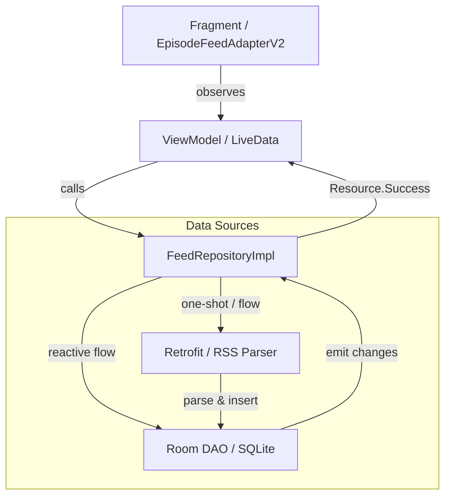

# RecyclerView & Data Flow Architecture Report

## Обзор
В проекте используется унифицированный подход к отображению списков эпизодов через `EpisodeFeedAdapterV2`. Этот адаптер заменяет старые версии и является основным инструментом отображения контента.

### Связанные отчеты:
- [Реализация Episode Feed V2](./workflows/episode-feed-v2-implementation.md) — детали внутренней работы адаптера и верстки.
- [ItemZoneTouchHandler Report](./itemzone_touch_handler_report.md) — обработка жестов, свайпов и Drag-and-Drop.

---

## 1. Экраны и Адаптеры

На данный момент `EpisodeFeedAdapterV2` используется на следующих экранах:

| Экран (Fragment) | ViewModel | Основной LiveData/Flow | Режим кнопок (PlaybackButtonMode) |
| :--- | :--- | :--- | :--- |
| **FeedFragment** | `FeedViewModel` | `rssFeed` | `DOWNLOAD` |
| **FeedPersonalFragment** | `FeedViewModel` | `rssFeedPersonal` | `DOWNLOAD` |
| **QueueFragment** | `QueueViewModel` | `rssQueue` | `PLAY_STREAMING` |
| **ChannelFragment** | `ChannelViewModel` | `rssChannel` | `DOWNLOAD` |
| **DownloadsFragment** | `DownloadsViewModel` | `rssDownloads` | `DELETE` |

---

## 2. Архитектура потока данных (Data Flow)

Схема взаимодействия компонентов:
`Fragment` <-> `ViewModel` <-> `Repository` <-> `Room Database (DAO)` / `Network (API)`

### Общий паттерн
1. **Database-First**: Большинство экранов получают данные из БД через `Flow` от Room. Это обеспечивает реактивное обновление UI при любых изменениях в локальной базе (например, при отметке "Избранное" или изменении прогресса).
2. **Resource Wrapper**: Репозиторий оборачивает данные в `Resource<T>` (Loading, Success, Error).
3. **AsyncListDiffer**: Адаптер использует `AsyncListDiffer` для вычисления разницы в фоновом потоке, что предотвращает фризы UI при обновлении больших списков.

### Детальные цепочки вызовов:

#### А. Общая лента (FeedFragment)
- **Запрос**: `viewModel.getRssFeedFromDatabase()`
- **Репозиторий**: `repository.getRssFeedFromDatabase()` -> возвращает `Flow<Resource<List<Episode>>>`.
- **Источник**: `db.dao.getAllFeedFlow()` (реактивный Flow от Room).
- **Обновление (Network)**: `updateFeedRss()` -> `api.getFullChannelsFeed()` -> `insertApiResponseToDatabase()` -> Room автоматически триггерит Flow.

#### Б. Персональная лента (FeedPersonalFragment)
- **Логика**: Работает на основе данных общей ленты, но применяет фильтрацию на стороне ViewModel.
- **Цепочка**: `rssFeed.observe` -> `refreshRssFeedPersonal()` -> Фильтрация по `filterStringsSet` -> `_rssFeedPersonal.postValue()`.

#### В. Очередь (QueueFragment)
- **Запрос**: `viewModel.updateQueueRss()`
- **Репозиторий**: `repository.getRssQueueFromDatabase()` -> `db.dao.getQueueFeedFlow()`.
- **Специфика**: В `QueueViewModel` происходит дополнительная сортировка по `indexInQueue`. Также реализован механизм `isDragAndDropActive` для предотвращения мерцания списка во время перетаскивания.

#### Г. Канал (ChannelFragment)
- **Запрос**: `viewModel.getRssChannelFromDatabase(channel)`
- **Репозиторий**: `repository.getRssChannelFromDatabase(channel)` -> создает `flow { ... }`.
- **Источник**: `db.dao.new_getChannelFeed(channelId)`. 
- **Особенность**: Если по точному ID канала ничего не найдено, используется `backupResult` с поиском по вхождению строки в заголовок.

#### Д. Загрузки (DownloadsFragment)
- **Запрос**: `viewModel.updateDownloadsRss()`
- **Репозиторий**: `repository.getRssDownloadsFromDatabase()` -> `db.dao.getDownloadedEpisodes()`.
- **Источник**: `Flow` с применением `distinctUntilChanged()`. 

---

## 3. Схематичная картина (Flow Diagram)

## 4. Завершенные исправления (Bug Fixes)
- [x] **DownloadsFragment: Стабильность списка**: Добавлена сортировка `ORDER BY timestamp DESC` в `FeedDao.getDownloadedEpisodes()`. Ранее отсутствие сортировки приводило к случайному перемешиванию элементов при обновлении прогресса или лайков.
- [x] **DownloadsFragment: Устранение мерцания**: Отключен `itemAnimator` в `RecyclerView` для предотвращения визуальных "прыжков" элементов при переходе на экран и фоновых обновлениях.

## 5. Будущие правки и планы
- [ ] Оптимизация `ChannelFragment`: переход на реактивный Flow вместо ручного создания `flow {}` в репозитории (для мгновенного обновления статусов).
- [ ] Реализация Multi-selection в `FeedPersonalFragment` и `DownloadsFragment` (аналогично `FeedFragment`).
- [ ] Улучшение `payload` системы в адаптере для минимизации обновлений при изменении только прогресса воспроизведения.
