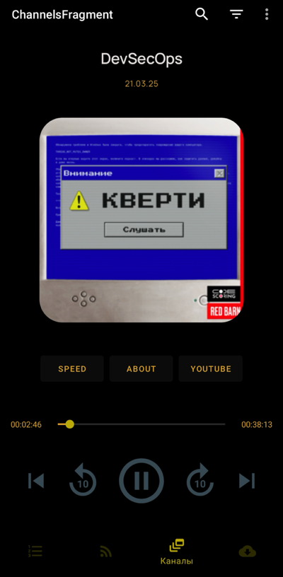
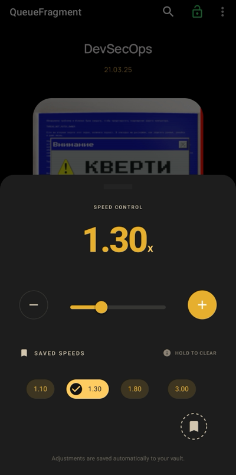
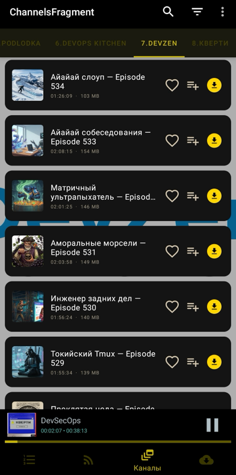
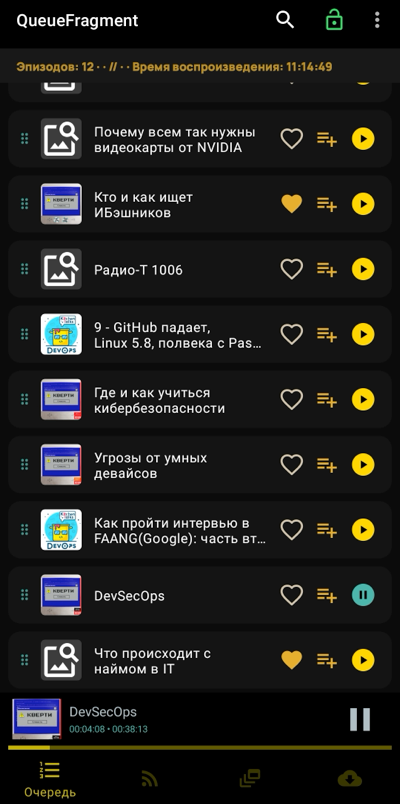
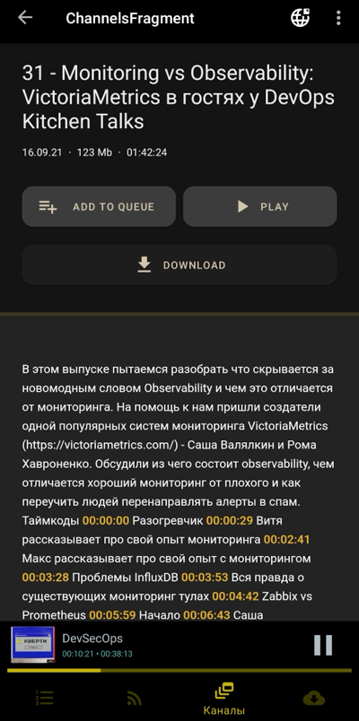
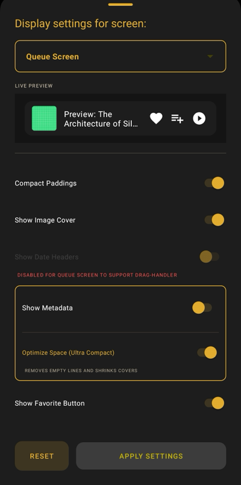

# Echo-proto

Android-приложение для прослушивания подкастов с поддержкой RSS-лент и офлайн-воспроизведения. Приложение позволяет подписываться на RSS-ленты подкастов, скачивать эпизоды для офлайн-прослушивания и управлять воспроизведением через фоновый сервис.

## Основные возможности

- **Подписка на подкасты**: Добавление RSS-лент любимых подкастов
- **Главный фид**: Общий список всех эпизодов из подписанных каналов
- **Канальные фиды**: Просмотр эпизодов по отдельным каналам
- **Офлайн-воспроизведение**: Скачивание эпизодов для прослушивания без интернета
- **Фоновый сервис**: Воспроизведение в фоновом режиме с управлением через уведомления
- **Reactive UI**: Автоматическое обновление интерфейса при изменении данных
- **Swipe-to-refresh**: Обновление ленты свайпом вниз
- **ViewPager2**: Плавная навигация между экранами

## Технологический стек

### Core
- **Kotlin**: Основной язык разработки
- **Min SDK**: 23 (Android 6.0)
- **Target SDK**: 33 (Android 13)

### Архитектура
- **MVVM**: Model-View-ViewModel архитектура
- **Hilt**: Dependency Injection
- **Coroutines**: Асинхронное программирование
- **Flow + LiveData**: Reactive streams для данных и интеграция с UI-компонентами
- **Repository Pattern**: Разделение бизнес-логики

### База данных
- **Room**: Local database
- **Flow**: Reactive queries

### Сеть
- **RSSParser**: Парсинг RSS/XML лент
- **OkHttp**: HTTP клиент
- **Okio**: Эффективная работа с буферами

### UI
- **ViewBinding**: Type-safe view binding
- **Material Design**: Material Components
- **Navigation Component**: Навигация между экранами
- **ViewPager2**: Горизонтальный и вертикальный скроллинг
- **RecyclerView**: Эффективные списки
- **SwipeRefreshLayout**: Pull-to-refresh
- **Glide**: Загрузка и кеширование изображений

### Мультимедиа
- **ExoPlayer**: Воспроизведение аудио
- **MediaSession**: Интеграция с системой
- **MediaBrowserService**: Фоновый сервис

### Другие библиотеки
- **WorkManager**: Фоновые задачи
- **Timber**: Логирование
- **EasyPermissions**: Управление разрешениями


## Структура проекта

```
app/
├── data/           # DAO, Entity, Интерфейсы репозиториев
├── di/             # Hilt модули
├── domain/         # Worker, Имплементация репозиториев
├── exoplayer/      # ExoPlayer сервис и утилиты
├── ui/             # Fragments, ViewModels, Adapters, 
└── utils/          # Вспомогательные классы
```


## Скриншоты

### 1. UI плеера

*Можно свайпать вверх, чтобы перейти к описанию воспроизводимого эпизода. Сам плеер смахивается вниз и висит минимизированным в боттомшите.*

---

### 2. Выбор скорости воспроизведения

*Выбор скорости с пресетами (кнопками или прогрессбаром).*

---

### 3. Список эпизодов на экране канала

*Список эпизодов (RecyclerView) на экране канала. Каналы листаются во ViewPager2. Навигация на другие экраны через боттомбар.*

---
### 4. Список эпизодов в очереди

*Список эпизодов на экране очереди. Можно менять порядок перетаскиванием, удалять свайпом. Дизайн айтемов минимизирован. Персональный стиль отображения можно настроить для каждого типа экрана с RecyclerView.*

---
### 5. Полное описание эпизода

*Координатор-лэйаут с полным описанием воспроизводимого эпизода. Можно добавлять в очередь, скачивать аудиофайл для оффлайн-воспроизведения или воспроизвести сразу из сети. Ссылки и таймкоды кликабельны.*

---
### 6. Настройка UI отображения эпизода

*Экран настройки UI отображения эпизода. Персонализация и сохранение состояния происходит для каждого типа экрана с RecyclerView (очередь, лента, каналы, загрузки). Можно минимизировать паддинги, убрать картинку эпизода, кнопки добавления в очередь и избранное.*